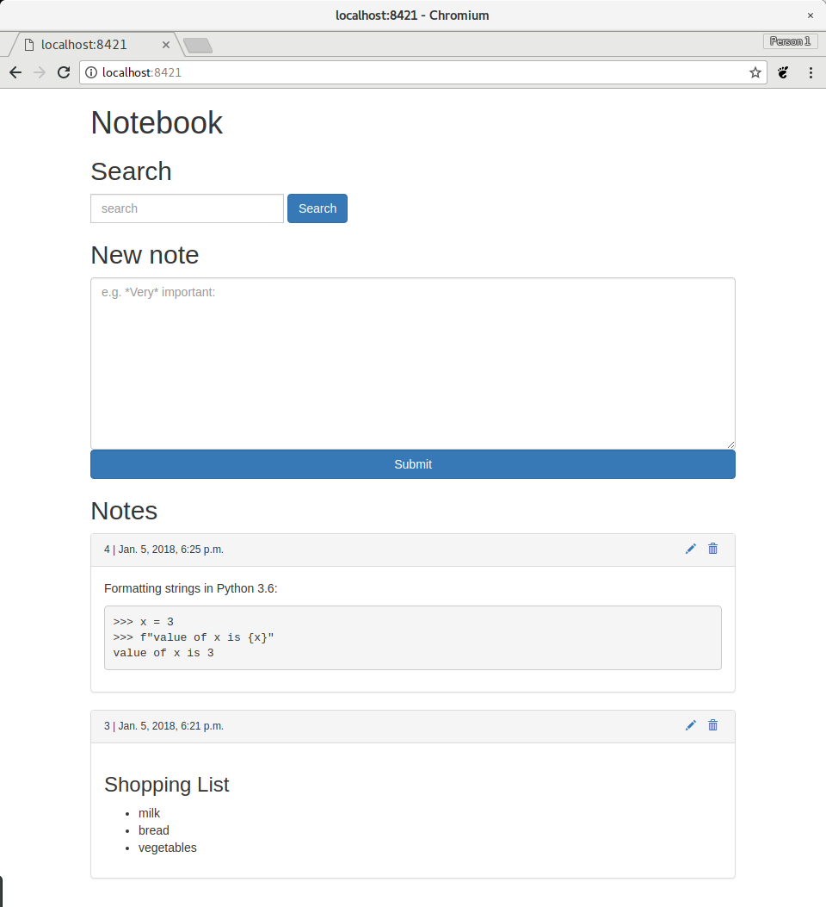

# notebook

Searchable notebook with markdown syntax.



## Requirements

* Python 3.6
* pip
* virtualenv
* bower

## Install

```bash
cd /path/to/workspace
git clone git@github.com:jjbayer/notebook.git
cd notebook
mkvirtualenv -p $(which python3.6) -a $(pwd) notebook
pip install -r requirements.txt
python manage.py migrate
bower install
```

## Usage

Warning: only use runserver if you are running it locally.


1. Start the server

```bash
cd /path/to/workspace/notebook
python manage.py runserver 8421
```

2. Navigate your browser to http://localhost:8421.

## TODO

- [ ] Pagination
- [ ] Keyboard shortcut to save note
- [ ] Syntax highlighting in editor
